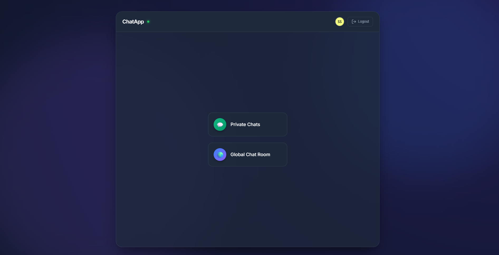

# 🔥 Premium Firebase Real-time Chat App

A feature-rich, modern, and fully responsive real-time chat application built with **Firebase**, **HTML5**, **CSS3**, and **Vanilla JavaScript**.

## 🚀 Key Features

### 🔐 Secure Authentication
*   **User Sign-up & Login**: Secure account creation and access powered by Firebase Auth.
*   **Session Persistence**: Stay logged in even after refreshing the page.
*   **Automatic Avatars**: Profile pictures are automatically generated based on the display name.

### 💬 Multi-Room Messaging
*   **1-on-1 Private Chats**: Private, secure conversations with any registered user.
*   **Global Chat Room**: A shared public space for all users to talk together.
*   **Real-time Synchronization**: Messages appear instantly without needing to refresh.

### 📱 Premium UI/UX
*   **Dashboard Navigation**: A clean central hub to switch between private and global modes.
*   **Glassmorphism Design**: Modern, dark-mode aesthetic with blurred backgrounds and smooth animations.
*   **Responsive Profile Card**: A sleek modal view to see your profile details (Name, Email, UID) and manage your session.
*   **Mobile First**: Fully optimized for smartphones, tablets, and desktops.

### 🖼️ Rich Media Sharing
*   **Image Messages**: Send and receive images instantly in any chat room.
*   **Firebase Storage**: Securely host and deliver images using high-performance cloud storage.

### 🔍 Utility Features
*   **User Search**: Quickly find friends in the private chat sidebar with real-time filtering.
*   **Back Navigation**: Easy-to-use back buttons to return to the dashboard from any room.
*   **XSS Protection**: Built-in HTML escaping to keep the chat safe from malicious scripts.

## 🛠️ Tech Stack
*   **Frontend**: HTML5, CSS3 (Vanilla), JavaScript (ES6 Modules)
*   **Backend**: Firebase Realtime Database & Firebase Storage
*   **Authentication**: Firebase Auth (Email/Password)
*   **Avatars**: UI Avatars
*   **Deployment**: GitHub Pages / Firebase Hosting

## 📁 Project Structure
*   `index.html`: Entry point & Authentication Dashboard.
*   `private.html`: Private 1-on-1 messaging interface.
*   `global.html`: Global group chat interface.
*   `/img/`: Project image assets and icons.
*   `/css/`: 
    *   `style.css`: Core application styles.
    *   `dashboard.css`: Specific styles for the navigation hub.
*   `/js/`:
    *   `auth.js`: Logic for Login, Signup, and Dashboard.
    *   `private.js`: Handles user listing, search, and private messaging.
    *   `global.js`: Handles global room syncing.
